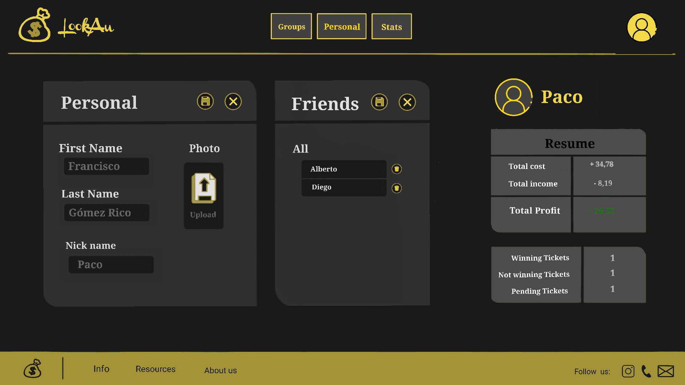
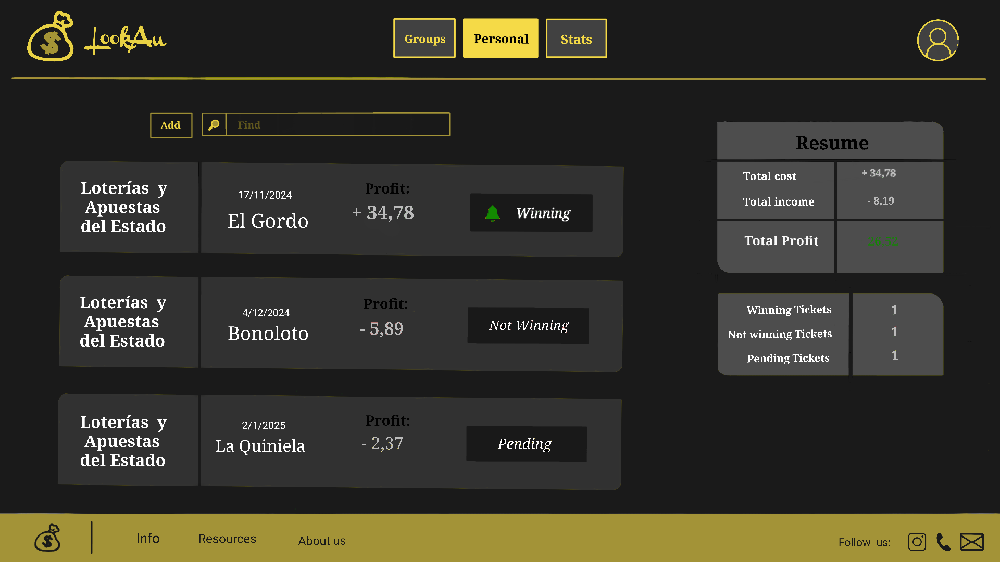

# LookAu 💰 

## Table of contents

- [Phase 0](#phase-0)
	- [Members](#members-of-the-development-team)
	- [Main aspects](#main-aspects-of-the-web-application)

- [Phase 1](#phase-1)
	- [Screenshots](#screenshots)
		- [Unregisted Users](#unregisted-users)
		- [Registed Users](#registed-users)
		- [Only Admins](#only-admins)
		- [Only Students](#only-students)
		- [Only Teachers](#only-teachers)

- [Phase 2](#phase-2)
	- [Update navigation diagrams](#update-navigation-diagram-and-templates)
	- [Navigation instructions](#navigation-instructions)
	- [Diagram with database entities](#diagram-with-database-entities)
	- [Class diagram](#class-diagram)
	- [Main commits of the members P2](#main-commits-of-the-members-p2)

- [Phase 3](#phase-3)
	- [API REST documentation](#api-rest-documentation)
	- [Class Diagram](#class-diagram)
	- [Instructions dockerized app](#instructions-for-executing-the-dockerized-app)
	- [Instructions constructing docker image](#instructions-for-constructing-the-docker-image)
	- [Documentation deploying on virtual machine](#documentation-for-deploying-on-the-virtual-machine)
	- [URL of app in virtual machine](#url-of-the-application-deployed-on-the-virtual-machine)
	- [Main commits of the members P3](#main-commits-of-the-members-p3)

- [Phase 4](#phase-4)
	- [Installation and configuration for Angular](#installation-and-configuration-for-angular)
	- [Angular Class Diagram](#angular-class-diagram)
	- [Main commits of the members P4](#main-commits-of-the-members-p4)
    - [Video](#video)


## PHASE 0

### Members of the development team

| Name                      | e-mail                             | GitHub username      |
| ------------------------- | ---------------------------------  | ---------------      |
| Amanda Castro López       | a.castrol.2020@alumnos.urjc.es     | latinyloco           |


### Main Aspects of the Web Application 

- Entities: 
    + User
    + Groups
    + Tickets
    + Notifications

- User permissions: 
    + Registered user: edit own profile; create groups; create tickets; send friend notification.
    + Unregistered user: log in; sign up.

- Asociated Images to profiles and groups. 

- Use of Line Grafics for average profit.

- Advanced Query Algorithm: search groups, profiles and tickets (by date and by ticket type).


## PHASE 1

### Screenshots:

#### Unregisted Users

- **Login**: in this screen the registered users can login


- **SignUp**: On this screen, unregistered users can create an account on the page.


#### Registed Users

##### Profile

- **Profile**: On this screen, registered users will be able to view their profile, their friends, personal stats...


- **Edit Profile**: in this screen registered users will be able to edit their profile: photo, name, friends...



##### Groups

- **Main Groups**: where they can view, delete or add groups.


- **Add group**: where they can add a group.


- **One group**: where they can view a specific group and edit it (adding or delete friends).


- **Individual resume by group**: where they can view this individual resume and pay their debts.


- **Ticket by group**: where they can add a new teacher to a subject.


- **Edit ticket by group**: where they can add a new teacher to a subject.


- **Group profile**: where they can view the groups detail.


- **Group profile**: where they can edit the group.


##### Personal

- **Main personal ticket**: all personal ticket.


- **One personal ticket**: one personal ticket.


- **Personal ticket edit**: edit personal ticket.


##### Stats
- **Personal ticket edit**: edit personal ticket.


### Navigation diagram
This diagram shows how you can move through the different pages according to the type of user you are.


## PHASE 2:

### Update navigation diagram and templates
- **Forum**: We have created a new template for forums which will show the forum of each subject in which the students and teachers are gonna be able to talk and solve any question.

    - **Forum Teacher**: shows the forum of the subject. Teachers can delete any massage.
    

    - **Forums**:shows the forum of the subject.
    

So the new navigation diagram will be this one (the same as the other one but at the top we added forum.html): 

### Navigation instructions
Requirements: JDK 17, SprinBoot 3.0.0, MYSQL database (we used MySql Workbench), in VSCode download extensions "Extension Pack for Java" and "Spring Boot Extension Pack"
1. Download this repository
2. Configure database in MySQLWorkbench, creating a local instance of the database
3. In our navigator web (we recommend Chrome) we go to ""https://localhost:8443" and when it gives us the notice that the connection is not private we must click on "Advanced" and then on "Proceed to localhost (unsafe)"
4. Now everything should work and you can enjoy our application :)

### Diagram with database entities


### Class diagram


### Main commits of the members P2
 
#### Amanda Castro López 
| Commit       | Description |
|--------------|--------------|
| [1](https://github.com/CodeURJC-DAW-2023-24/webapp09/commit/0c2500d04bd78d19d272a2bca44e8b0541a677e8)    | Update TeacherController p2    | 
| [2](https://github.com/CodeURJC-DAW-2023-24/webapp09/commit/289de07227354314e079c0a830da5acc62b03ee5)    | Update AdminController p2    | 
| [3](https://github.com/CodeURJC-DAW-2023-24/webapp09/commit/ce8e31f512859c0486a752ea206fbc00aae91473)    | Udate Admincontroller p1    |
| [4](https://github.com/CodeURJC-DAW-2023-24/webapp09/commit/be8142249fb5dc217452ca4c1ddae4a05dd2e692)    | Update TeacherController p1    |
| [5](https://github.com/CodeURJC-DAW-2023-24/webapp09/commit/4d45cc42261d078b044cb49abc19bf39c0a980f1)    | Creates AdminController and StudentController    |

| File number    | File               |
|----------------|--------------------|
| [1]()          | TeacherController  | 
| [2]()          | StudentController  | 
| [3]()          | AdminController    |
| [4]()          | UserController     |
| [5]()          | SubjectController  |


#### Javier Rodriguez Salas 
| Commit       | Description |
|--------------|--------------|
| [1](https://github.com/CodeURJC-DAW-2023-24/webapp09/commit/d5cbaba004c81bb804d2ea3edaeef0f9a1c4f25b)    | Security module    | 
| [2](https://github.com/CodeURJC-DAW-2023-24/webapp09/commit/15aa85d2f065ba05bd74fdc78a774f981235dfd7)    | Integration of administrator and teacher logic    | 
| [3](https://github.com/CodeURJC-DAW-2023-24/webapp09/commit/a8c0595f92e97de0ca338d773cfb0efe17784793)    | Integration of administrator and teacher logic pt2    |
| [4](https://github.com/CodeURJC-DAW-2023-24/webapp09/commit/10176f33a61629a97bbbb192ef5c08ec05a6149e)    | Migrate to a mysql database    |
| [5](https://github.com/CodeURJC-DAW-2023-24/webapp09/commit/c009373eb28d14a5f6199ac41fece97135bfc904)    | AYAX  |


| File number    | File                   |
|----------------|------------------------|
| [1]()          | SecurityConfiguration  | 
| [2]()          | TeacherController      | 
| [3]()          | AdminController        |
| [4]()          | application.properties |
| [5]()          | SubjectController      |
 

## Phase 3:

  ### API REST documentation
  #### OpenAPI:
  ```
  https://github.com/CodeURJC-DAW-2023-24/webapp09a/blob/main/api-docs/api-docs.yam
  ```
  ####  HTML:
  ```
  https://github.com/CodeURJC-DAW-2023-24/webapp09a/blob/main/api-docs/index.html
  ```


  ### Class Diagram


  ### Instructions for executing the dockerized app
  
  1. Clone the repository with
  ```
  git clone https://github.com/CodeURJC-DAW-2023-24/webapp09a.git
  ```
  2. Switch to "docker" directory 
  ```
  cd webapp09a/docker
  ```
  3. Install docker on your system [here](https://docs.docker.com/engine/install/)
  4. Find the installed docker, and run it
  5. While being on the directory backend/docker, excute on terminal:
  ```
  docker-compose up
  ```
  6. Once the previous step is finished, open an internet browser, and search for [https://localhost:8443](https://localhost:8443)
  


  ### Instructions for constructing the docker image
  
  1. Use a browser to create an account on [Dockerhub](https://hub.docker.com/)
  2. Clone the repository with
  ```
  git clone https://github.com/CodeURJC-DAW-2023-24/webapp09a.git
  ```
  3. Switch to "docker" directory 
  ```
  cd webapp09a/docker
  ```
  4. Install docker on your system [here](https://docs.docker.com/engine/install/)
  5. Find the installed docker, and run it
  6. Connect your account to Docker. You can use:
  ```
  docker login
  ```
  And then type your credentials   
  
  7. While being on the directory backend/docker, excute on terminal:
  ```
  ./create_image.sh
  ```


 ### Documentation for deploying on the virtual machine

#### Connect to virtual machine
  Make sure to have the SSH key on the directory you execute these commands.
  Place it in the directory where prAppWeb12.key is located.
  ```
  chmod 600 prAppWeb12.key
  ssh -i prAppWeb09.key vmuser@10.100.139.118
  ```
  #### Install Docker
  ```
  sudo apt-get update
  sudo apt-get install ca-certificates curl
  sudo install -m 0755 -d /etc/apt/keyrings
  sudo curl -fsSL https://download.docker.com/linux/ubuntu/gpg -o /etc/apt/keyrings/docker.asc
  sudo chmod a+r /etc/apt/keyrings/docker.asc
  
  echo \
  "deb [arch=$(dpkg --print-architecture) signed-by=/etc/apt/keyrings/docker.asc] https://download.docker.com/linux/ubuntu \
  $(. /etc/os-release && echo "$VERSION_CODENAME") stable" | \
  sudo tee /etc/apt/sources.list.d/docker.list > /dev/null
  sudo apt-get update
  ```
  
  #### Install Docker-Compose plugin
  ```
  sudo apt-get install docker-ce docker-ce-cli containerd.io docker-buildx-plugin docker-compose-plugin
  ```
  
  #### Test Docker is correctly instaled running
  ```
  sudo docker run hello-world
  ```
  #### Prepare Docker Compose
  ```
  sudo curl -L "https://github.com/docker/compose/releases/download/1.29.2/docker-compose-$(uname -s)-$(uname -m)" -o /usr/local/bin/docker-compose
  sudo chmod +x /usr/local/bin/docker-compose
  ```
  #### Clone the repository
  Execute:
  ```
  git clone https://github.com/CodeURJC-DAW-2023-24/webapp09a.git
  ```
  As it is a private repository (for now), you will need a token and permissions to the repository.
  #### Switch to directory and grant premissions
  ```
  cd webapp12a/docker
  chmod u+x create_image.sh
  ```
  #### Modify the script
  To keep the application running when closing the SSH connection, it is necessary to instruct Docker Compose to launch the application in daemon mode with "-d" (docker-compose up -d).
  ```
  nano create_image.sh
  ```
  Now change "docker-compose up" to "docker-compose up -d". And save the file and exit the editor (Ctrl + O, Enter and Ctrl + x) 
  #### Execute the script
  ```
  ./create_image.sh
  ```
  If you encounter any issues while executing the script, do the following:
  ```
  sudo ./create_image.sh
  ```

 #### Open a browser and access
  ```
  https://10.100.139.118:8443
  ```


 ### URL of the application deployed on the virtual machine

 [https://10.100.139.118:8443](https://10.100.139.118:8443)


 ### Main commits of the members P3
 
 #### Amanda Castro López 
 | Commit       | Description |
 |--------------|--------------|
 | [1](https://github.com/CodeURJC-DAW-2023-24/webapp09a/commit/2d8f518908e99166da801f14a60ffc96ddffa91b)    | Show user image profile and anuyrest User uses  | 
 | [2](https://github.com/CodeURJC-DAW-2023-24/webapp09a/commit/13b06ae0e054fd5d0a1f04da9b3718029af925b1)    | Dowload file in UserRestController     | 
 | [3](https://github.com/CodeURJC-DAW-2023-24/webapp09a/commit/57b3aefb557aa45b8225a40e9d8a8829a2fd15cf)    | UserRestController and UserDTO done    |
 | [4](https://github.com/CodeURJC-DAW-2023-24/webapp09a/commit/de98844ecf5bf9819451cf5a74192d82ac54b89a)    | ExamRestController done    |
 | [5](https://github.com/CodeURJC-DAW-2023-24/webapp09a/commit/b770d3a4c7e92bbeab7ca0ce406550bf38dd0eb0)    | Update the banner with user photo and name    |

| File number | File         |
|-------------|--------------|
| [1]       | UserRestControler and his DTO | 
| [2]       | SubjectRestController and his DTO  | 
| [3]       | AjaxController  |
| [4]       | Reposotories and services  |
| [5]       | ExamRestController and ExamRestController  |


 #### Javier Rodriguez Salas 
| Commit       | Description |
|--------------|--------------|
| [1](https://github.com/CodeURJC-DAW-2023-24/webapp09a/commit/9e7ad6e1d8d8da2a53d1fde269c2b6d02b505a18)        |  Charts API and logic in services  | 
| [2](https://github.com/CodeURJC-DAW-2023-24/webapp09a/commit/5bb7e2df7b1aec52f2645da5b02102f4278c2b22)        |  Complete login/logout with API  | 
| [3](https://github.com/CodeURJC-DAW-2023-24/webapp09a/commit/c936a69e17fb2f4b9309be7ea2544d94df07b4ad)        |  Allow teachers to download exams for their subjects   |
| [4](https://github.com/CodeURJC-DAW-2023-24/webapp09a/commit/128909498715e7827d9ef24a4b37aa0e155eb6d0)        |  Application deployment with Docker and Docker-compose   |
| [5](https://github.com/CodeURJC-DAW-2023-24/webapp09a/commit/a1175283fda210f3c57df22d7911f1101f143c83)        |  Documentation of the REST API  |


| File number | Files         |
|-------------|---------------|
| [1]         |  ChartRestController and ChartService  | 
| [2]         |  LoginRestController, SecurityConfiguration and package jwt  | 
| [3]         |  TeacherRestController  |
| [4]         |  Package docker  |
| [5]         |  Package api-docs and pom  |
  
  

 ## Phase 4


 ### Installation and configuration for Angular

#### 1.1 Install Angular command-line tool
  -g option allows a global instalation, aviable for all your directories
  ```
  npm install -g @angular/cli
  ```
 #### 1.2 Clone or update the repository
  If you havent cloned the repository yet, then run
  ```
  git clone https://github.com/CodeURJC-DAW-2023-24/webapp09a.git
  ```
  If you have already cloned the repository, then you could try to pull for new changes.
  Make sure to execute the command on the root of the cloned project
  ```
  git pull
  ```
#### 1.3 Install Angular modules
  ```
  cd webapp09a/frontend
  ```
  Now, you can install the Angular modules defined on the 
  Angular project with:
  ```
  npm install
  ```
#### 1.4 Serve Angular project
  Once finished, you can run the following
  ```
  npm start
  ```
  And access the index with: https://localhost:8443/new/index.html

 ### Angular class diagram
 


 ### Main commits of the members P3
 
 #### Amanda Castro López 
 | Commit       | Description |
 |--------------|--------------|
 | [1](https://github.com/CodeURJC-DAW-2023-24/webapp09a/commit/dc3b8187e50ea3396afb6d845e2133ee6f57b992)  |  Teacher examStudent completed and create new exam  | 
 | [2](https://github.com/CodeURJC-DAW-2023-24/webapp09a/commit/292cd395e4b1c22ec01c52f7f24ecbfe6e5e1ba8) |  Teacher exam completed and teacher examStudent in progress  | 
 | [3](https://github.com/CodeURJC-DAW-2023-24/webapp09a/commit/d067d9108559510f982735c612da5d74650a44b3)  |   General information completed for all users (login fixed)  |
 | [4](https://github.com/CodeURJC-DAW-2023-24/webapp09a/commit/c5cab4801b6500f4a43e9638d18b8098073a31bd)  |  Add new or notnew teacher added and user subjects ajax added  |
 | [5](https://github.com/CodeURJC-DAW-2023-24/webapp09a/commit/bb3869753e4e5d6348b50a0800e722b1047380e7) |   All from admin view one subject and add and create teacher  |

| File number | File         |
|-------------|--------------|
| [1]       | main.component | 
| [2]       | add_user.component, add_exam.component | 
| [3]       |  exam.component, exam_student.component |
| [4]       | nav_tab.component, banner.component |
| [5]       |  general_information.componente |


#### Javier Rodriguez Salas 
 | Commit       | Description |
 |--------------|--------------|
 | [1](https://github.com/CodeURJC-DAW-2023-24/webapp09a/commit/4adcc64e2ec30f22c6967901de6284f135ce04d0), [1](https://github.com/CodeURJC-DAW-2023-24/webapp09a/commit/4c15a4f1881395260abdf5500e6264b8fea9eea9) |  Login and signup | 
 | [2](https://github.com/CodeURJC-DAW-2023-24/webapp09a/commit/516fbfb59c7a6208de0194e11f3c0e493249aebe)  |  View profile  | 
 | [3](https://github.com/CodeURJC-DAW-2023-24/webapp09a/commit/0dc71cc5d45e0bd53ea2949de13246e8893d92d6)  |  Edit profile   |
 | [4](https://github.com/CodeURJC-DAW-2023-24/webapp09a/commit/3edff0967b39b4adf4f42e2f28c07d03506075bc), [4](https://github.com/CodeURJC-DAW-2023-24/webapp09a/commit/f7bdb09d40159055f9699ba3958a020a468a6a5d)  |  View marks for student and teacher  |
 | [5](https://github.com/CodeURJC-DAW-2023-24/webapp09a/commit/f5b044450b8048757250d584175c7af2bd6c3b39)  |  Forum   |

| File number | File         |
|-------------|--------------|
| [1]       | login.component and signup.component | 
| [2]       | profile.component | 
| [3]       | editProfile.component |
| [4]       | marks_student.component and marksExamStudent.component |
| [5]       | forum.component  |


### Video

https://www.youtube.com/watch?v=rXqQhpB92WI


